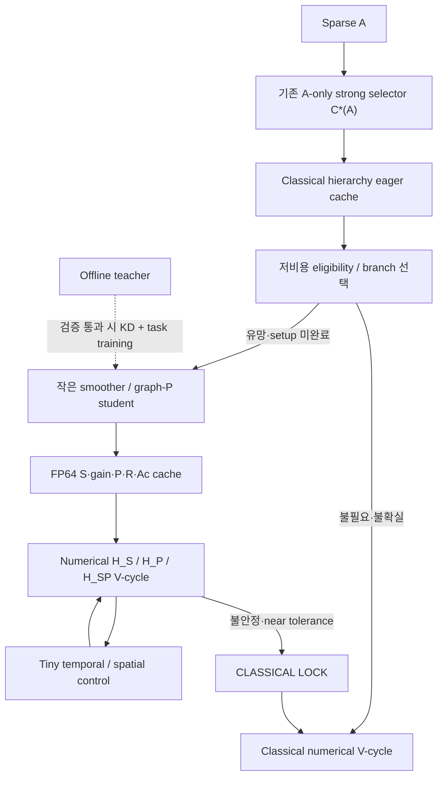

# Strong Classical 기준 Neural MG 연구 아키텍처

이 경로의 연구 질문은 **기존 deployable strong Classical MG의 견고함을 유지하면서,
학습한 대체 연산자가 setup 포함 time-to-tolerance를 줄이는가**입니다.
모델을 구현하거나 smoke 학습을 끝낸 사실은 이 질문에 대한 긍정적 답이 아닙니다.
채택과 최종 주장은 서로 분리한 검증 절차를 통과해야 합니다.

## 1. 유지하는 수치적 기반과 비교 단위

`strong.py`의 A-only deterministic selector는 그대로 사용합니다. 각 학습 operator에
선택한 strategy, rule id, rules digest를 기록하고, 모든 neural branch가 그 C*(A)의
transfer·coarsening·smoothing 구성을 기준으로 출발합니다. Family 이름, RHS,
정답, 최종 test 시간으로 selector를 바꾸지 않습니다.

| Branch | Smoother | Transfer/coarse hierarchy |
| --- | --- | --- |
| C | 선택된 classical | 선택된 classical |
| H_S | 일부 classical work를 student smoother로 replacement | 선택된 classical |
| H_P | 선택된 classical | student P로 replacement |
| H_SP | student smoother replacement | student P replacement |

각 branch의 pre/post work budget, FP64 residual, tolerance, attempt/cycle budget,
안전장치와 numerical kernel은 동일한 비교 계약을 따릅니다. H_SP를 자동으로 최선이라
취급하지 않습니다. P를 추가했을 때 H_S보다 나쁘면 H_S를 유지할 수 있습니다.
Fixed Classical과 과거 fixed-baseline-aware H_S는 historical/control 행이며,
최신 main baseline은 기존 strong selector의 C*(A)입니다.

Teacher에서 solve로 향하는 실행 경로는 없습니다. 큰 network는 수치 cycle에서
잔차를 받아 출력을 매번 만드는 모델이 아니라, A로부터 재사용할 연산자를 만드는
offline/setup generator입니다.

## 2. Smoother: 같은 입력과 9-point numerical output

새 모델은 모두 기존 열 개 feature를 입력으로 사용합니다. 첫 채널은 median 대비
diagonal의 log scale이고, 나머지는 diagonal로 정규화한 9-point A stencil입니다.
출력은 하나의 9-point direction과 level/sample당 양의 scalar gain입니다.

\[
 C_\theta = \frac{z_\theta}{\sqrt{\sum_{d=1}^{9} z_{\theta,d}^2+\epsilon}},\qquad
 g_\theta=g_{\min}+(g_{\max}-g_{\min})\sigma(\gamma_\theta).
\]

기본 gain 범위는 `[1e-4,2]`입니다. 작은 epsilon은 정규화의 특이점을 완화하므로
norm은 정확히 1이 아니라 1 이하이며, 비영 direction에서 1에 가깝습니다. 이 제한만으로
MG 수렴이 증명되지는 않습니다. 기존 replacement budget, rollback, CLASSICAL LOCK을
계속 사용합니다. Generation 결과는 기존 StencilBank/native numerical kernel에 전달합니다.

### Ordinary CNN과 D4

`ordinary_control`은 기존 residual5 body를 유지하면서 새 비교의 공통 single-basis,
bounded-gain 계약을 사용합니다. 과거 checkpoint 자체의 재현은 원래 모델 loader로
별도 수행합니다. `student_residual`은 같은 크기에서 direct/KD를 비교할 수 있는
독립 모델이고, `student_cnn`은 작은 compact3 대안입니다.

D4 모델은 공간 위치와 stencil 방향 채널을 함께 변환하는 정확한 Reynolds 평균입니다.
90도 회전 네 개와 반사 두 종류의 총 여덟 view를 encoder에 넣고, 출력을 원래 frame으로
되돌린 뒤 평균합니다. Square grid에서는 여덟 view를 한 batch로 묶고, rectangular
semicoarsened level에서는 모양별 두 batch로 묶습니다.

이는 부동소수점 오차 범위에서 D4-equivariant하지만 **encoder 계산량은 여덟 배**입니다.
한 Python forward call로 batching했다고 single-view 비용이 되는 것은 아닙니다.
실제 generation wall time과 메모리 부담을 숨기지 않고 기록해야 합니다.

### O(2): 연속 tensor algebra와 사각 격자를 구분

열 개 입력을 네 scalar, 두 종류의 radial order-1 vector, 하나의 order-2 pair로 바꿉니다.
Signed moments는 `(x,y)`, `r²(x,y)`, `(x²-y²,2xy)`를 사용합니다. 두 order-1 radial
moment를 모두 보존하여 lift가 열 입력에 대해 full rank가 되도록 했습니다. 따라서
단순히 방향을 요약하다 입력 두 성분을 버리는 방식이 아닙니다.

Order-1 pair는 angle theta, order-2 pair는 angle 2theta로 회전합니다. 반사는 각 pair의
두 번째 성분 부호를 바꿉니다. 비scalar에 독립적인 componentwise GELU를 적용하지 않고,
scalar gate·invariant norm·equivariant tensor product를 사용합니다. 공간 kernel은
radial Gaussian basis 및 다음 analytic harmonics를 grid에서 sampling합니다.

\[
 \psi_1(x,y)=e^{-r^2/2}(x,y),\qquad
 \psi_2(x,y)=e^{-r^2/2}(x^2-y^2,2xy).
\]

기본 작은 모델은 scalar 12, order-1 6, order-2 6 channel과 residual block 세 개입니다.
Parameter budget 비교에서는 폭을 조정할 수 있습니다. 예를 들어 ordinary/D4 폭 16의
10,906 parameters에 O2 폭 18의 약 10,100 parameters를 맞출 수 있습니다. 정확한 수는
실제 checkpoint/model metadata로 기록합니다. 같은 parameter 수가 같은 실행 비용을
뜻하지는 않습니다.

연속 kernel constraint와 irreducible representation 구성은
[Weiler–Cesa의 steerable CNN 정식화](https://arxiv.org/abs/1911.08251)를 따릅니다.
[escnn kernel 문서](https://quva-lab.github.io/escnn/api/escnn.kernels.html)도 연속 basis와
그 basis를 점에서 sampling하는 단계를 구분합니다. 이 구현은 추가 의존성 없이 만든
작은 pure-Torch subset이며 escnn의 전체 kernel space를 구현했다고 주장하지 않습니다.

**연속 O(2) tensor/kernel/head algebra가 정확하다는 것과, 고정 사각 격자의 모든 각도에서
전체 network가 정확히 공간-equivariant라는 것은 다릅니다.** 임의 각도로 회전한 grid
point와 9-point offset은 원래 격자에 남지 않습니다. Resampling, 경계, 유한 support,
9-point normalization으로 오차가 생깁니다. Unit tests는 정확한 D4 관계 및 임의각도·반사의
tensor/kernel 관계를 검사합니다. 별도 resampling diagnostic은 실제 오차를 기록합니다.
최종적인 판단은 새 각도의 PDE contraction, 성공률, setup 포함 solve 시간으로 합니다.

## 3. Transfer P: sparse graph와 numerical constraint

Transfer 대안은 기존 CNN-P control, 작은 message-passing GNN, sparse edge-MLP,
training-only 큰 GNN teacher입니다. Graph 입력은 실제 A의 sparse connectivity와
diagonal/row magnitude·strength·방향·classical C/F 역할·interpolation support입니다.
Solution 또는 RHS를 입력으로 사용하지 않습니다.

\[
 P_\theta=P_C+\Delta P_\theta,\qquad R=P_\theta^T,\qquad A_c=P_\theta^TAP_\theta.
\]

이 식의 P_C와 delta를 numerical cycle에서 두 번 적용하지 않습니다. 합쳐진 sparse P
하나를 만들고 cache합니다. 기본 4×4 candidate slots와 선택적 6×6 expanded-support
ablation만 사용하며 dense/global P는 만들지 않습니다. Expanded support는 geometry와
coarse/fine relation으로 결정한 유한 후보 집합입니다.

기존 classical row sum과 coarse injection을 유지합니다. Dirichlet 경계가 있으므로
모든 행의 합을 임의로 1로 바꾸는 것이 아니라 해당 P_C의 row sum을 보존합니다. Support
cap이 필요한 경우 top-k를 선택하고, FP32→FP64 변환 뒤 살아남은 support에서 row sum을
보정하여 roundoff가 zero edge를 되살리지 않게 합니다. Training은 동일한 numerical
forward와 discrete support 선택의 straight-through surrogate gradient를 구분합니다.

Coarse injection은 P의 column independence를 유지합니다. SPD A와 full-rank P에 대한
Galerkin operator는 수학적으로 SPD지만, 실제 실행에서는 finite values와 factorization,
complexity cap도 검사하며 실패 setup 비용을 기록하고 classical로 복구합니다.

\[
 C_{op}=\frac{\sum_l\operatorname{nnz}(A_l)}{\operatorname{nnz}(A_0)},\qquad
 C_P=\frac{\sum_l\operatorname{nnz}(P_l)}{N_0}.
\]

Row nnz, P fill ratio, coarse A fill ratio와 전체 hierarchy complexity를 제한합니다.
Training의 soft occupancy/AP work 항은 미분 가능한 비용 proxy이고 실제 nnz나 wall
time 그 자체가 아닙니다. 수렴이 좋아도 setup/fill 증가로 total time이 나빠지면 P를
채택할 근거가 없습니다. 같은 support budget을 CNN-P control에도 적용합니다.

## 4. Strong-aware task loss와 조건부 KD

각 sample의 저장된 C*(A)를 사용해 실제 full multilevel V-cycle을 여러 번 unroll합니다.
Learned prefix 후 classical tail을 포함할 수 있으며, fine-grid FP64 residual을 기준으로
weighted log residual objective를 만듭니다. Coarse correction을 생략한 local MSE만으로
후보를 학습하는 경로가 아닙니다.

Smoother KD는 정규화된 direction 차이와 log-gain Huber loss를 사용합니다. P KD는
동일한 ordered candidate edge의 interpolation 값으로 정의합니다. Teacher target은
detach하며 student task gradient가 teacher로 전달되지 않습니다. Task loss에는 residual
growth penalty, transfer work proxy, 실제 training operator에서 보정한 cycle cost를
함께 기록합니다. 고정 architecture·cycle schedule의 measured cost는 상수이므로,
perf_counter를 미분한다고 주장하지 않습니다.

실험 순서는 direct student → architecture ablation → teacher upper bound → 조건부 KD
→ task-only fine-tuning → joint candidate입니다. Teacher가 direct student를 유의미하게
이기지 못하면 KD를 실행하거나 채택할 이유가 없습니다. KD도 동일 크기 direct student에
대한 별도 검증을 통과해야 합니다. Teacher cost와 student deployment cost는 별도로 기록합니다.

Teacher factory의 `training_only` 표지는 checkpoint 복원 후에도 유지됩니다. Numerical
generation은 명시적 offline teacher context에서만 허용하며, 그 context에서 만들어진
bank라도 밖에서 cached teacher solve로 재사용하지 못하도록 RHS 진입 때 검사합니다.
이 검사는 매 V-cycle에 큰 NN을 호출하는 검사가 아닙니다.

## 5. Cache·precision·runtime

Classical hierarchy는 eager, student bank는 lazy입니다. Student generation 단위는
**현재 model/config와 실제 level operator A_l**입니다. 한 root A의 hierarchy에 learned
level이 여러 개 있으면 각 level에서 한 번씩 생성하므로, 전체 hierarchy를 통틀어
무조건 한 번의 forward라는 뜻이 아닙니다. P 변경으로 실제 A_l이 달라지면 해당 smoother
재생성도 필요합니다. 같은 A의 RHS들에서는 이미 생성한 hierarchy/operators를 재사용합니다.
H_S와 H_SP의 hierarchy key가 달라도 실제 A_l과 smoother/model·precision·native 설정이
같으면 level stencil cache를 공유합니다. 따라서 P를 추가하면서 바뀌지 않은 root A의
smoother를 다시 생성하지 않고, 실제로 변경된 coarse A에서만 새 smoother를 생성합니다.

Generation은 FP32이고 numerical cache와 solve는 CPU FP64입니다. CSR/native backend와
기존 C++/OpenMP numerical work를 유지하며, 매 V-cycle에는 cached sparse operator만
적용합니다. Spatial detector는 WHERE, temporal controller는 WHEN, 저비용 branch utility는
WHICH를 맡습니다. Learned P를 spatial patch마다 바꾸거나 residual에 따라 hierarchy를
재조립하지 않습니다. CLASSICAL LOCK 이후에는 heavy student/teacher generation이 없습니다.

CPU/MPS/CUDA generation benchmark는 실제 prepared bank를 만듭니다. Device가 실제로
available한 경우에만 측정하고, 미지원은 `not_measured`, 실패는 elapsed cost가 있는 failed
record로 남깁니다. A100 결과는 실제 해당 hardware가 있을 때만 주장할 수 있습니다.
MPS FP32가 CPU보다 빠르다고 가정하지 않습니다.

Cold single RHS, unchanged-A warm solve, RHS count 1/4/16/64의 amortized total time을
구분합니다. Setup은 selector, classical setup, student generation, device copy,
sparse assembly/factorization 및 실패 복구를 포함합니다. 중첩되는 timing 항을 다시
더하지 않습니다. 성공 solve의 같은 operator cohort에서만 speedup을 계산하며 실패를
빠른 측정으로 처리하지 않습니다.

## 6. 데이터 경계와 최종 판단

기존 train/tune/audit, 이미 분석한 35-case audit 및 14-case validation은 historical
operator digest로 제외합니다. 새 train과 validation은 normalized operator digest가
겹치지 않게 생성하고 C*(A) 선택을 함께 저장합니다. Final 및 OOD specification은
사전 고정하되 development 단계에서 해당 A를 assemble·select·solve하지 않습니다.

Architecture, weight, selector rules, 새 controller/detector를 고정한 뒤 single-use
final gate를 통해 새 final/OOD 평가를 수행합니다. Validation은 선택 자료이고 final
certificate 자료가 아닙니다. Small smoke에서는 final test를 실행하지 않습니다.

최종 비교는 같은 A,b,x0,FP64 tolerance, budget, hardware/thread 조건에서 성공·정답
오차·cycle·setup·solve·total time·neural use·fallback·complexity를 함께 봅니다.
Actual neural branch를 쓰지 않은 classical fallback 결과를 neural acceleration이라고
부르지 않습니다. Strong Classical보다 새 failure가 없어야 하고, setup 포함 geometric
speedup과 그 uncertainty가 채택 기준을 만족해야 합니다. 결과가 부정적이면 기존 strong
classical 또는 더 단순한 student를 유지합니다.

실행 명령은 [STRONG_AWARE_README_KR.md](../STRONG_AWARE_README_KR.md), 개별 수학/API
설명은 [smoother notes](research_smoothers_notes.md)와
[generation notes](research_generation_notes.md)를 참고하세요.
